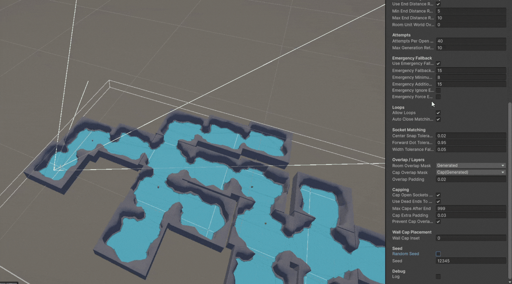
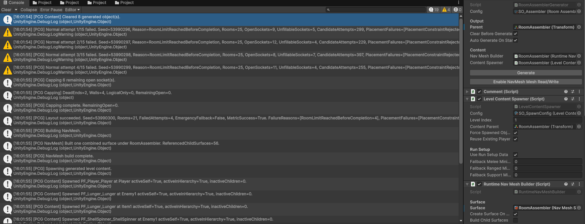
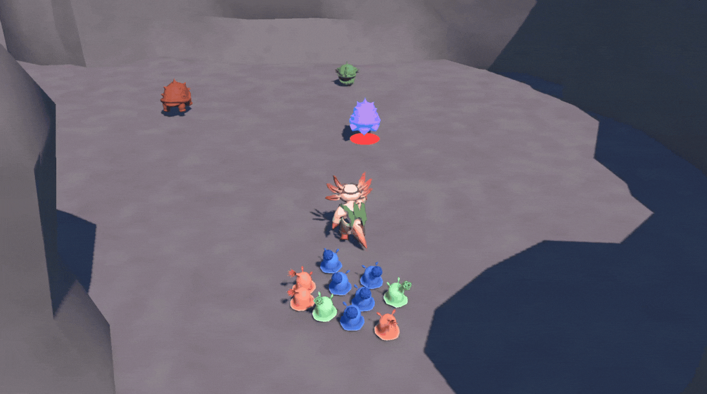
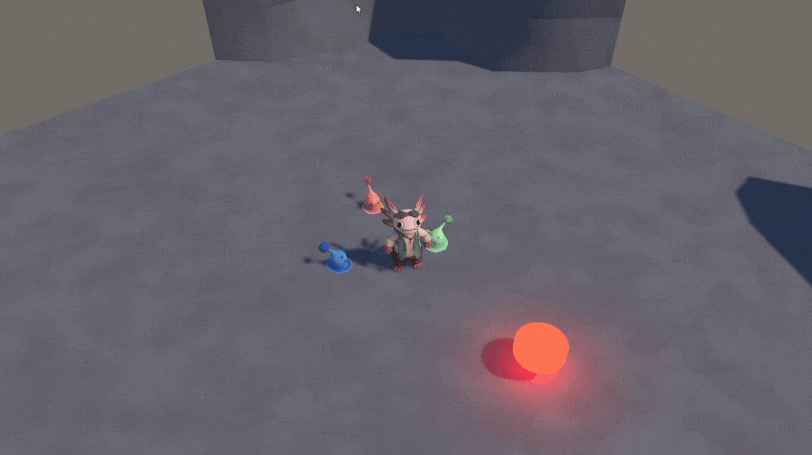

# Axolite: Cursed Doubloons

Axolite: Cursed Doubloons is a 3D roguelite in which the player commands AI-controlled companion units to fight enemies and progress through procedurally generated levels.

> Portfolio documentation fork  
> This project is developed as a team project. This fork focuses on project documentation, media, my own programming contributions, and the technical parts I can explain in detail.  
> The original repository is linked through GitHub's fork relationship.

## Overview

Axolite: Cursed Doubloons is a 3D adventure roguelite built with Unity and C#.
The project was created as a fifth-semester university project.

The player controls a character inspired by the indirect unit-control gameplay of Pikmin. The player can move, dodge and punch, but the main mechanic is commanding companion units called Sluglings.

The Sluglings can be sent to attack enemies or called back to the player. During a run, the player collects upgrades for the Sluglings and can later unlock player upgrades for more flexible gameplay.

## My Role

I worked on this project as the only programmer in the team.

My main contributions:
- Procedural level generation using prefab rooms and designer-defined rules in the Unity Inspector
- Seed-based generation logic, making generated levels reproducible
- Enemy and item spawning after successful level generation
- Player controller with movement, dodge, punch, minion commands, ground cursor and Cinemachine camera switching
- Slugling logic for melee, ranged and support companion types
- AI pathfinding and state machine logic for companion behavior
- Enemy logic for three enemy types with mechanics such as following, spinning, projectile shooting and purging
- Stat system for damage, speed, healing and related gameplay values
- Gameplay physics interactions for player, enemies, companions and projectiles

## Technical Focus

- Unity gameplay programming with C#
- Procedural level generation
- Seed-based generation
- Companion AI and state machines
- Player mechanics and interaction systems
- Enemy behavior systems
- Gameplay physics interactions
- Stat and combat systems
- Cinemachine camera handling

## Media

### Procedural Generation



Same seed produces the same generated layout, while random seed mode creates a different layout for each run.

- Example Code: [`RoomAssemblerGenerator, Line 112-140`](Assets/Scripts/Systems%20%26%20Utils/PCG/RoomAssemblerGenerator.cs#L112-L140)
Handling fixed/random seeds, retry setup and deterministic `System.Random` initialization.

```csharp
            int totalRetries = normalRetries + fallbackRetries;
            int initialSeed = seedOverride ?? (config.randomSeed ? Environment.TickCount : config.seed);
            metrics.initialSeed = initialSeed;

            for (int attempt = 0; attempt < totalRetries; attempt++)
            {
                if (clearBeforeGenerate) ClearChildren(parent);

                bool emergencyFallback = attempt >= normalRetries;
                metrics.emergencyFallbackUsed = emergencyFallback;
                metrics.fullAttemptsUsed = attempt + 1;
                int displayAttempt = emergencyFallback
                    ? attempt - normalRetries + 1
                    : attempt + 1;
                int displayAttemptLimit = emergencyFallback ? fallbackRetries : normalRetries;

                if (emergencyFallback && attempt == normalRetries)
                {
                    Debug.LogWarning(
                        $"[PCG] Normal generation failed after {normalRetries} attempts. " +
                        $"Starting {fallbackRetries} bounded emergency fallback attempt(s) with relaxed constraints.",
                        this);
                }

                int runSeed = initialSeed + attempt;

                LastRunSeed = runSeed;
                metrics.seed = runSeed;
                rng = new System.Random(runSeed);
```

The generator also logs on how the PCG tried to generate layouts for designer and programmer to better adjust values.



The generator records retry attempts, socket capping, NavMesh building and content spawning after a successful layout pass.

### Companion Commands



Sluglings can be ordered to attack enemies or objects. The command system selects suitable companion units based on role and current target state.



The player can recall nearby Sluglings or dismiss them into role-based formation positions around the player.

Download/play:
- Itch.io: Coming soon
- GitHub Release: Coming soon

Development setup:
- Coming soon

## Project Context

This project was developed as a university team project.

This fork is used as a portfolio documentation version. It does not replace the original team repository and does not attempt to list every team member's contribution. The sections above focus on my own work and the technical areas I can discuss in detail.

The project is still in development. This fork reflects the project state from 18 August 2026 and will only be updated for major milestones or portfolio-relevant changes.

## Links

- Original repository: [LinusKorihs/GruenderGame](https://github.com/LinusKorihs/GruenderGame)
- [Portfolio](https://Linustheuringer.com)
- Itch.io: Coming soon
